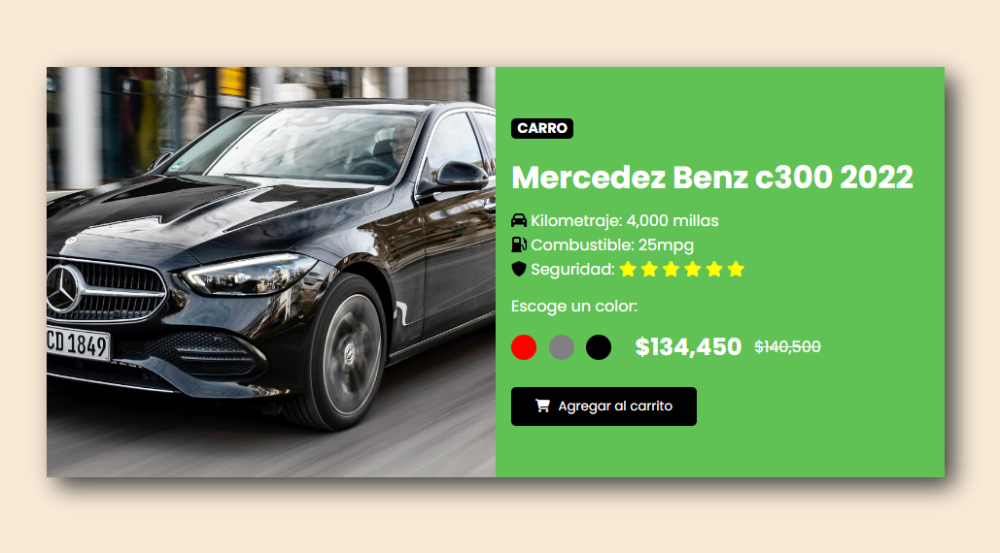

# 🖥️ Dynamic DOM Styling Project 

Este repositorio proporciona una base para explorar los diferentes tipos de manipulación del DOM en JavaScript y construir un proyecto que demuestra cómo cambiar dinámicamente algunos elementos.
Permite a los usuarios interactuar con la interfaz de usuario y cambiar la apariencia de un card mediante la manipulación del DOM. Al hacer clic en los botones de color (rojo, gris y negro), se realizan cambios en el fondo del card y en los colores de los botones y la imagen.

### 📂 Capturas de Pantalla



### 🧰 Tecnologías Empleadas 

- HTML
- CSS
- JavaScript

### 📌 Requisitos para el Funcionamiento Actual 
- Visual Studio Code

### ✏ Requisitos para Realizar el Testing

El testing se debe realizar utilizando Vitest. A continuación, se detalla el proceso para ejecutar los tests:

1. Clonar el repositorio
```
git clone https://github.com/FemCoders-BCN/dom-exercise-annaLucian

```
2. Navega al directorio del proyecto
```
cd tu_repositorio

```
3.Instala las dependencias necesarias

```
npm install

```
4-Ejecuta las pruebas utilizando Vitest

```
npm run test

```

Con estos pasos, podrás ejecutar y verificar las pruebas para asegurarte de que el proyecto funciona según lo esperado.
    
## contribuciones

Siéntete libre de contribuir al proyecto mediante solicitudes de pull requests para mejorar la funcionalidad o corregir problemas.

¡Gracias por tu interés y contribuciones!
